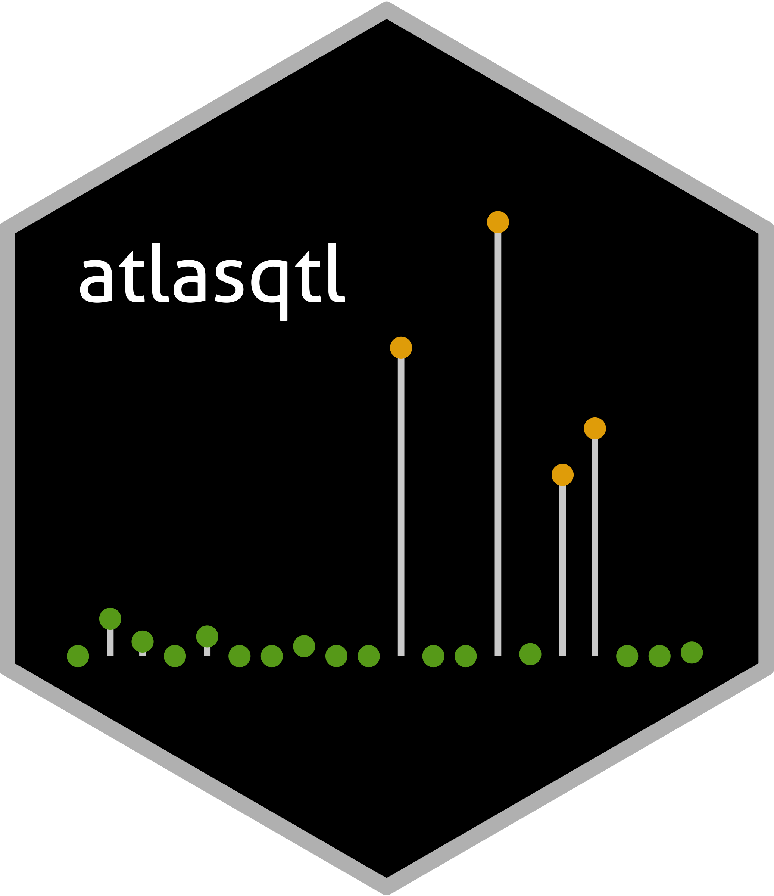

<!-- README.md is generated from README.Rmd. Please edit that file -->

<!-- First time: run usethis::use_readme_rmd() to create a pre-commit hook that 
prevents from committing if the README.Rmd has changed, but has not been 
re-knitted to generate an updated README.md -->

## atlasqtl - a fully joint QTL mapping method for detecting weak genetic effects 

<!-- Run for the R CMD checks, run usethis::use_github_actions() to set up the pipeline, possibly modify the .yaml file and then: -->

<!-- [](https://github.com/hruffieux/atlasqtl/actions) # TODO. not enabled yet, needs pre-install of GSL lib for windows -->

<!-- [](https://travis-ci.org/hruffieux/atlasqtl) -->

[](https://www.gnu.org/licenses/gpl-3.0)
[](https://github.com/hruffieux/atlasqtl)
[](https://github.com/hruffieux/atlasqtl)
[](https://doi.org/10.1214/20-AOAS1332)

## Overview

*atlasqtl* is an R package for joint molecular QTL mapping in eQTL, pQTL
or mQTL studies. The method is tailored to the detection of weak genetic
effects, including pleiotropic effects, exerted by QTL hotspots that
control multiple molecular traits. It implements a scalable Bayesian
hierarchical model for variable selection in high-dimensional
multi-response regression.

The model uses a horseshoe shrinkage formulation to share information
across co-regulated traits, thereby flexibly adapting to the sparse
nature of genetic signals. It efficiently handles thousands of genetic
variants and molecular phenotypes through batch variational inference,
coupled with simulated annealing to better explore complex parameter
landscapes. The R package calls C++ subroutines for computational
efficiency.

Reference: H. Ruffieux, A. C. Davison, J. Hager, J. Inshaw, B. Fairfax,
S. Richardson, and L. Bottolo. A global-local approach for detecting
hotspots in multiple response regression. The Annals of Applied
Statistics, 14:905-928, 2020.

## Warning

**This is a development branch**, it is not guaranteed to be stable at
any given time and features are subject to change. Please use the
[stable version](https://github.com/hruffieux/atlasqtl), unless you want
to test and report issues.

## Installation

**Important note:** the R package depends on the GSL library which needs
to be manually installed. For example on Ubuntu,

``` bash
$ sudo apt-get install libgsl-dev
```

or on mac,

``` bash
$ brew install gsl
```

after having installed Homebrew.

Then, to install the package in R, run the following command:

``` r
if(!require(remotes)) install.packages("remotes")
remotes::install_github("hruffieux/atlasqtl", ref = "devel")
```

## License and authors

This software uses the GPL v3 license, see [LICENSE](LICENSE). Authors
and copyright are provided in [DESCRIPTION](DESCRIPTION).

## Issues

To report an issue, please use the [atlasqtl issue
tracker](https://github.com/hruffieux/atlasqtl/issues) at github.com.
